# manualist

When it comes to Natural Language Processing, text and oral speech are just a start; we still have the whole manual world to explore! The ideal manual language AI agent would be one fluent in common sign languages and capable of quicly learning others. This is my attempt to build an end-to-end system for American Sign Language to English translation - a modest, yet surprisingly challenging step towards the ideal.

The pipeline for this translation system is as follows:
1. Instead of using the entire image for classification, we utilize MediaPipe to track hand and pose positions, and only use these landmarks. For now, only head position has been saved from the pose tracking system. Using separate predictors for hand and head landmarks introduces some normalization issues, which have not yet been addressed. Because of this, only hand positions are currently being used. We use all 21 landmarks provided by MediaPipe hands.
2. These hand and head positions are now used as inputs to a Convolutional Recurrent Neural Network for classification. Labels are currently encoded using GloVe word embeddings, with multi-word phrases being encoded as the sum of their parts. This has much room for improvement.

## Landmarks
Instead of looking at the entirety of every frame, we're isolating the hands in our videos using MediaPipe hands, and use these landmarks as the input of our model. Let's visualize tracking a single landmark in time.

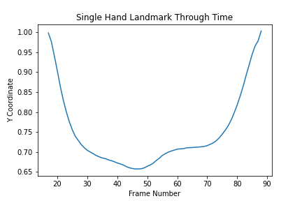

Now let's look at another, with null values replaced with zeros.

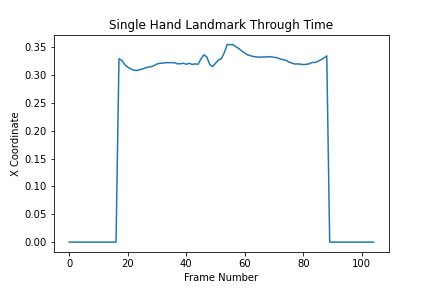

Now let's take a look at the x-y projection of an entire hand through a series of frames.

| | | |
|:-------------------------:|:-------------------------:|:-------------------------:|
|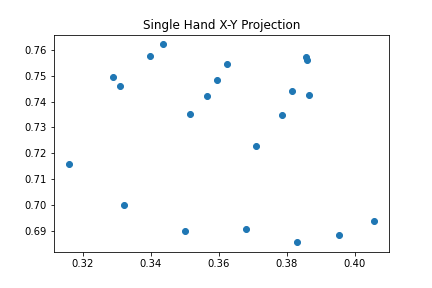  Frame 1 | 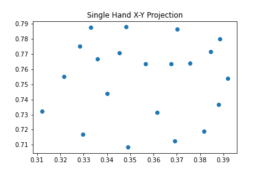 Frame 2 |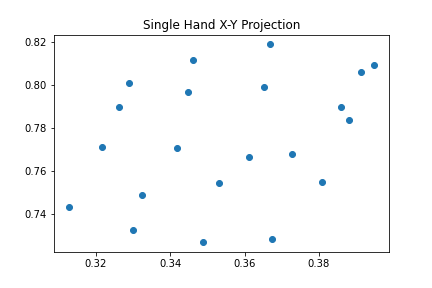 Frame 3 |
|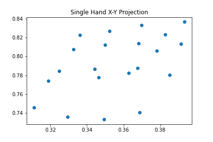  Frame 4 | 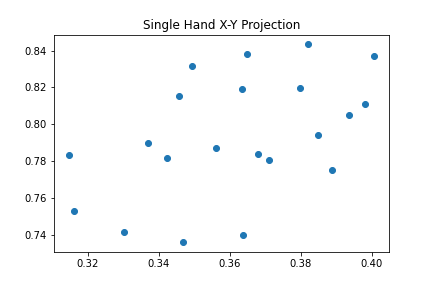 Frame 5 |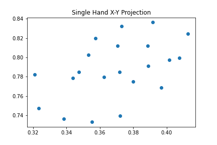 Frame 6 |
|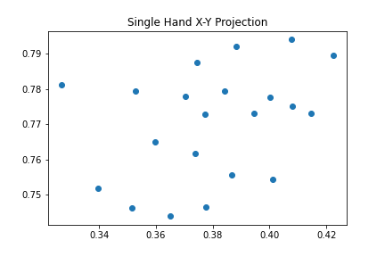  Frame 7 | 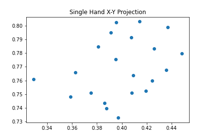 Frame 8 |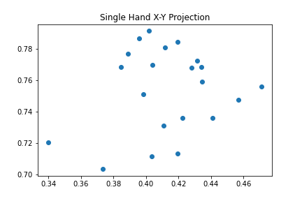 Frame 9 |

## Current State
Many videos have been converted to sequences of hand/head locations and saved. A simple classification model has been built to predict the GloVe embedding of these samples, and has been trained for a handful of batches.

## Implementations
```python
""" Example driver code for current functionalities."""
import data.annotater as annotater
from data.encoding.label_encoder import create_label_embeddings
from data.datasets.one_hand import OneHand120, load_sample

from constants import DATA_SOURCE, DATA_DIRECTORY

# --- Annotater.
# Loads videos, annotates with hand and nose landmarks, save results for training later.
annotater.annotate_videos(data_source=DATA_SOURCE, save_directory=DATA_DIRECTORY)

# --- Label encoding.
# Loads desired label embeddings for every word in current vocabular, as a dictionary.y.
embeddings = create_label_embeddings(model_name='glove-twitter-25')

# --- Loading samples.
# Load json samples.
example_paths = [
    'files/data/train/00414.json',
    'files/data/train/70356.json',
    'files/data/train/70239.json',
    'files/data/train/53067.json',
    'files/data/train/26535.json'
]
embedding_path = 'files/data/labels/label-embeddings-glove-twitter-25.json'
import json
with open(embedding_path, 'r') as f:
    label_embedding = json.load(f)

for example_path in example_paths:
    features, label = load_sample(file_path=example_path, label_embedding=label_embedding)
    print('Number of features:', len(features))
    print('Number of time steps:', features[2].shape[0])
    print('hand0 shape:', features[0].shape)
    print('hand1 shape:', features[1].shape)
    print('hand0 shape:', features[2].shape)
    print('label shape:', label.shape)
    print()

# --- Data loader.
dataset = OneHand120()
data_loader = dataset.train_loader
for batch_number, (features, labels) in enumerate(data_loader):
    print('Batch Number:')
    print(batch_number)

    print('Feature Shapes:')
    print(features[0].shape)
    print(features[1].shape)
    print(features[2].shape)

    print('Label Shape:')
    print(labels)

    print('Feature Minimums:')
    print(torch.min(features[0]))
    print(torch.min(features[1]))
    print(torch.min(features[2]))

    print('Feature Maximums:')
    print(torch.max(features[0]))
    print(torch.max(features[1]))
    print(torch.max(features[2]))

    if batch_number == 5:
        break

```

## TODOs
1. Dedicate the compute needed to convert more samples and train the baseline classifier.
2. Attempt to incorporate unsupervised pretraining by creating a hand-to-vec embedding model, to be used instead of raw hand and head coordinates.
